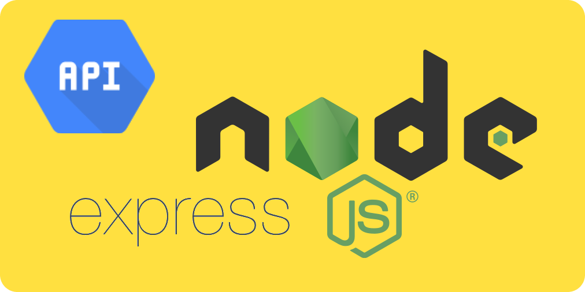
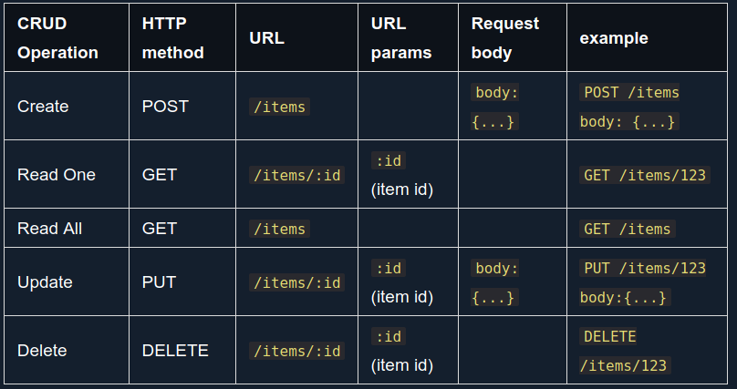

## What is REST API

> REST or RESTful stands for REpresentational State Transfer. It is an architectural style as well as an approach for communications purposes that is often used in various web services development. In simpler terms, it is an application program interface (API) that makes use of the HTTP requests to GET, PUT, POST and DELETE the data over WWW.

REST architectural style helps in leveraging the lesser use of bandwidth which makes an application more suitable for the internet. It is often regarded as the “language of the internet”. It is completely based on the resources where each and every component is regarded as a component and a single resource is accessible through a common interface using the standard HTTP method.

To understand better, let’s dive a little deeper and see how exactly does a REST API work. Basically, the REST API breaks down a transaction in order to create small modules. Now, each of these modules is used to address a specific part of the transaction. This approach provides more flexibility but requires a lot of effort to be built from the very scratch.

The main functions used in any REST-based architecture are:

- GET − Provides read-only access to a resource.
- PUT − Creates a new resource.
- DELETE − Removes a resource.
- POST − Updates an existing resource or creates a new resource.

## Basic api using NodeJS and ExpressJS

Create a directory

```js

mkdir api-node

npm init

npm install -g express-generator

npm install express --save

```

The save flag is used to edit your package.json file and add express as a dependency.

**Creating the app**.

Then create the `app.js` file or whatever you prefer naming it (default is index.js) and add in the following code.

```js
var express = require("express");
var app = express();

app.listen(3000, () => {
console.log("Server running on port 3000");
});

```

Congrats! You just made your first useless express server!

```js
node app.js
```

Your app will now be accessible using `http://localhost:3000`

```js

app.get("/url", (req, res, next) => {
res.json(["Tony","Lisa","Michael","Ginger","Food"]);
});

```

`node app.js`

open up your browser and enter `http://localhost:3000/url`

## HTTP Methods



Create data.js file. Feel free to add items, and item details.

```js
// data.js
module.exports = [
        { "id": "1234", "name": "The Lion King", "genre": "animation"},
        { "id": "5678", "name": "The Godfather", "genre": "crime"},
        { "id": "9101", "name": "The Dark Knight", "genre": "action"},
];
```

module.exports exposes this array to other files

```js
// app.js
let data = require('./data');
```

## GET

Get all items

### GET /items

```js
app.get("/items", (req, res) => {
res.json(data);
});
```

Get one item identified by :id

### GET /items/:id

We use Array.find to get the first item that matches the condition,
then display a message if not found.

Note that the item id is a string e.g. 1234, so we can compare it using=== directly.
You'll have to parse before comparing, if you are using an integer id.

```js
app.get("/items/:id", (req, res) => {
const itemId = req.params.id;
const item = data.find(_item => _item.id === itemId);

if (item) {
        res.json(item);
} else {
        res.json({ message: `item ${itemId} doesn't exist`})
}
});
```

```sh
curl http://localhost:4000/items

```

## Result

```json
[{"id":"1234","name":"The Lion King","genre":"animation"},
{"id":"5678","name":"The Godfather","genre":"crime"},
{"id":"9101","name":"The Dark Knight","genre":"action"}]
```

```sh
curl http://localhost:4000/items/1234
```

```json
{"id":"1234","name":"The Lion King","genre":"animation"}
```

```sh
curl http://localhost:4000/items/blahblah
```

```json
{"message":"item blahblah doesn't exist"}
```

## POST

To encode the body of the request sent by client in a POST message, we need body-parser middleware.
This allows us to use req.body in our route handler

```bash
npm install body-parser
```

Then we import and use it. We'll just accept JSON-encoded body for now.

```js
// app.js

const body_parser = require('body-parser');

// parse JSON (application/json content-type)
app.use(body_parser.json());
```

## Post an item

### POST /items

Here, we are getting entire item from req.body since it matches our data,
but note that it is also possible to just get, e.g. req.body.name

```js
// app.js

...
app.post("/items", (req, res) => {
const item = req.body;
console.log('Adding new item: ', item);

// add new item to array
data.push(item)

// return updated list
res.json(data);
});
```

```sh
curl -X POST -H "Content-Type: application/json" --data '{"id": "4568", "name": "Forrest Gump", "genre": "drama"}' http://localhost:4000/items
```

```json
[..., {"id":"4568","nam4568e":"Forrest Gump","genre":"drama"}]
```

## PUT

To update an item, we expect client to pass item id in the URL param (req.params.id)
and the updated object in the body (req.body)

Here we simply replace the old one using forEach, but you could apply your own
algorithm to replace an object or an object's attribute in an array of objects.

```js
// update an item
app.put("/items/:id", (req, res) => {
const itemId = req.params.id;
const item = req.body;
console.log("Editing item: ", itemId, " to be ", item);

const updatedListItems = [];
// loop through list to find and replace one item
data.forEach(oldItem => {
        if (oldItem.id === itemId) {
        updatedListItems.push(item);
        } else {
        updatedListItems.push(oldItem);
        }
});

// replace old list with new one
data = updatedListItems;

res.json(data);
});

```

Let's say you really think The Dark Knight is a drama 😢 instead of action,...

```sh
curl -X PUT -H "Content-Type: application/json" --data '{"id": "9101", "name": "The Dark Knight", "genre": "drama"}' http://localhost:4000/items/9101
```

```json
...{"id":"9101","name":"The Dark Knight","genre":"drama"}...
```

## DELETE

Lastly for delete, we only need id URL param from client.
We filter the array, excluding the item to be deleted.

```js
// delete item from list
app.delete("/items/:id", (req, res) => {
const itemId = req.params.id;

console.log("Delete item with id: ", itemId);

// filter list copy, by excluding item to delete
const filtered_list = data.filter(item => item.id !== itemId);

// replace old list with new one
data = filtered_list;

res.json(data);
});
```

```sh
curl -X DELETE http://localhost:4000/items/1234
```

```json

[{"id":"1234","name":"The Lion King",
"genre":"animation"},{"id":"tt0068646",
"name":"The Godfather","genre":"crime"}]

```

Usefull commands:

POST Command

```sh
curl -X POST -H "Content-Type: application/json"  --data '{ "name":"apples", "price":500}' http://localhost:3000/
```

GET Command

```sh
curl -X GET http://localhost:3000/all
```

PUT Command

```sh
curl -X PUT -H "Content-Type: application/json"  --data '{"id":"5e32afebd18f8f316d8c3f7c", "name":"tomato", "price":800}' http://localhost:3000/update/record
```

DELETE Command

```sh
curl -X DELETE -H "Content-Type: application/json"  --data '{ "id":"5e32afebd18f8f31"}' http://localhost:3000/
```
