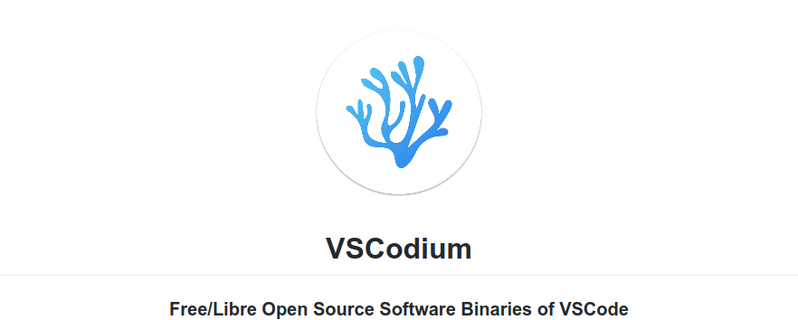

>VSCodium is a fork of Microsoft’s popular Visual Studio Code editor. It’s identical to VS Code with the single biggest difference that unlike VS Code, VSCodium doesn’t track your usage data.

I am writing this blog post in [VSCodium](https://github.com/VScodium). What? Is that like VSCode?

Yes, it’s basically VSCode minus the corporate bullshit like surveillance and proprietary-licensed binaries.

Microsoft’s Visual Studio Code is an excellent editor not only for web developers but also for other programmers. Due to its features, it’s considered one of the best open source code editors.

Yes, it’s one of the many open source products from Microsoft. You can easily install Visual Studio Code in Linux thanks to the ready to use binaries in the form of DEB, RPM and Snap packages.

And there is a problem which might not be an issue for a regular user but significant to an open source purist.

The ready to use binaries Microsoft provides are not open source.

Confused? Let me explain.

The source code of VS Code is open sourced under MIT license. You can access it on the GitHub. However, the installation files that Microsoft has created contain proprietary telemetry/tracking.

This tracking basically collects usage data and sends it to Microsoft to ‘help improve their products and services’. Telemetry reporting is common with software products these days. Even Ubuntu does that but with more transparency.

You can disable the telemetry in VS Code but can you trust Microsoft completely? If the answer is no, then what are your options?

You can build it from the source code and thus keep everything open source. But installing from source code is not always the prettiest option specially in today’s world when we are so used to of having binaries.

Another option is to use VSCodium!

## Enter VSCodium

So it turns out that some enterprising freedom-lovers created a project called VSCodium that takes the MIT-licensed source code, removes the telemetry (surveillance) from the codebase (along with the branding) and licenses the resulting binaries under the MIT license, just like the code itself.

How awesome!

## 1. **Install VSCodium with auto updates**

On Debian-derived operating systems that have the apt package manager:

```sh
# Authorise Paul Carroty’s repository.
# (https://twitter.com/paulcarroty)
wget -qO - https://gitlab.com/paulcarroty/vscodium-deb-rpm-repo/raw/master/pub.gpg | sudo apt-key add -

# Add Paul’s custom apt repository to your apt sources list.
echo 'deb https://gitlab.com/paulcarroty/vscodium-deb-rpm-repo/raw/repos/debs/ vscodium main' | sudo tee --append /etc/apt/sources.list

# Update your apt package list and install VSCodium.
sudo apt update
sudo apt install codium
```

## 2. **Copy your extensions and settings over from VSCode to VSCodium.**

On Linux:

```sh
# Create the folder to host your extensions.
mkdir -p ~/.vscode-oss/

# Copy your extensions over from VSCode.
cp -R ~/.vscode/extensions ~/.vscode-oss/

# Create the folder to hold your settings.
mkdir -p $HOME/.config/VSCodium/

# Copy your settings over from VSCode.
cp -R $HOME/.config/Code/User $HOME/.config/VSCodium/User/
```

Viola!! you have successfully ported to VSCodium.

After you’ve followed the above instructions – or those for your own platform – you should be able to launch VSCodium by just typing **codium** in Terminal.
